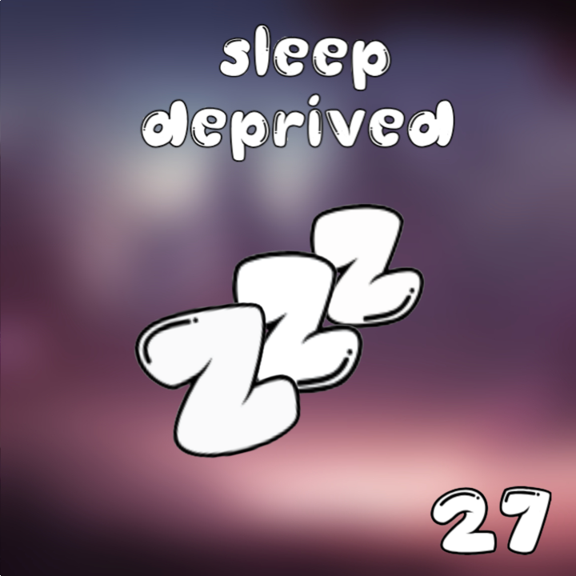
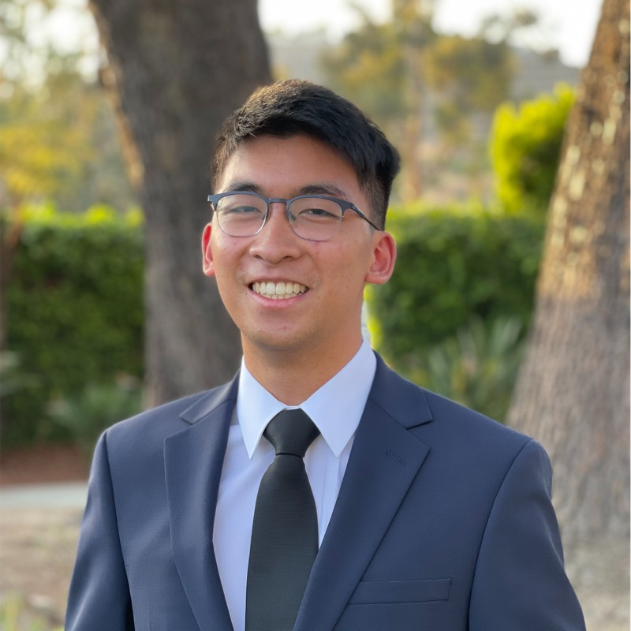
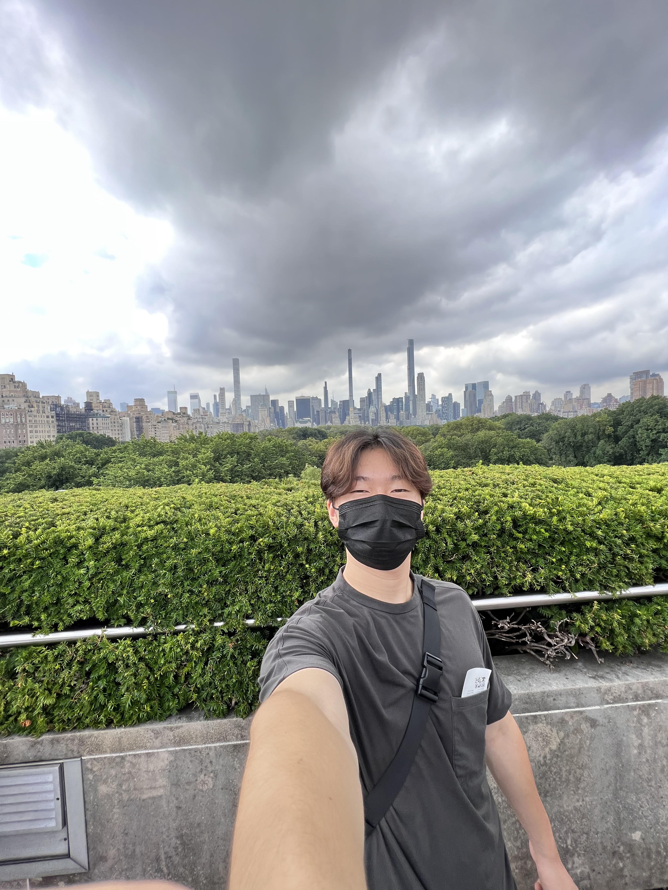
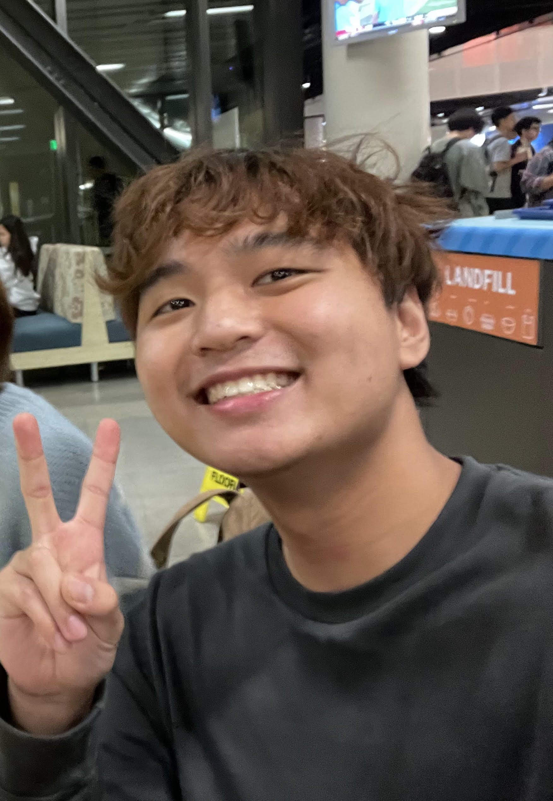
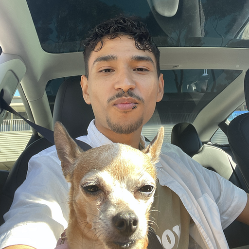
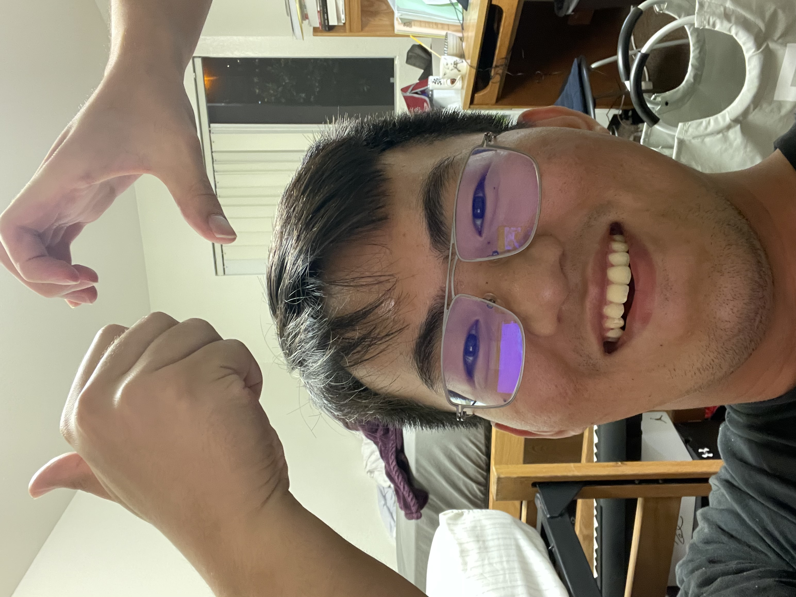
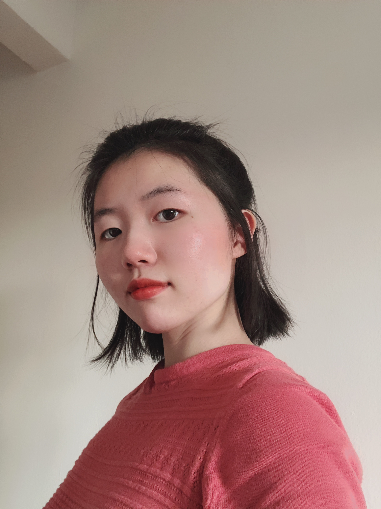
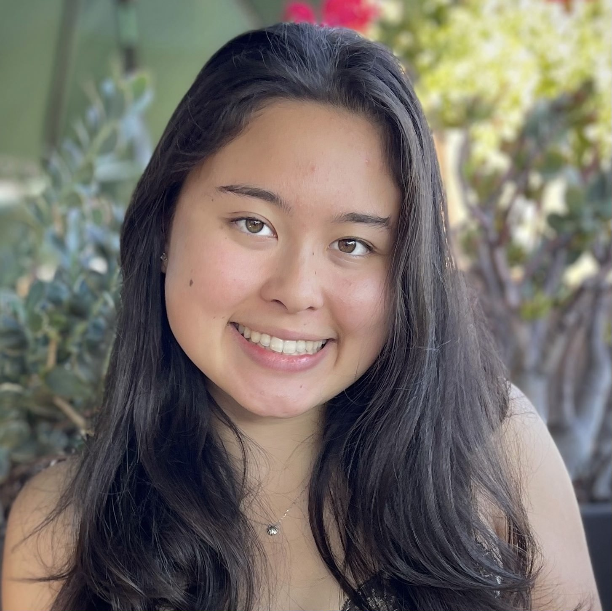
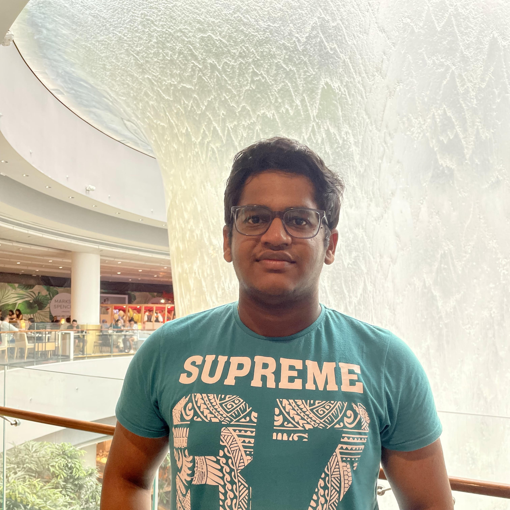

# **Team Sleep Deprived Group Page** :zzz:

  

Welcome to the **Team Sleep Deprived** Group Page! Here at **Team Sleep Deprived**, we believe in creating quality software that won't keep you up all night. Our developers work endlessly to ruin their sleep schedules so you don't have to ruin your own! Below you will find a brief description of our team brand and values as well as a short bit of information about each teammate.
 

## <ins>**Team Brand**</ins>
Our team is currently still in the process of figuring the complete picture of our brand, but we do have some characteristic designs. Our team logo is done and we plan to decorate our software with colors that remind people of the sleep and the night (dark blue/purple colors, for example). I (Jake) also like the idea of using cats as a sort of brand mascot :smiley_cat:
 

## <ins>**Team Values and Mission**</ins>

Here at **Team Sleep Deprived**, we strive to make clean and effective software that helps make life easier.  In software, we value simplicity, effectiveness, and ingenuity. Within our team, we value strong communication, psychological safety, and fun. Our mission this quarter is to create an information management CRUD app. Hopefully our app can prove to be an effective and good piece of software.

## <ins>**Meet the Team**</ins>

### **Anthony Chen** - [Github](https://github.com/achen200)

   

Worked on the CI/CD and front end/backend features. (humor) Also is the team’s public relations manager
  

### **Michael Phung** - [Github](https://github.com/klm4life)

   

Created Github issues for backend functionality and worked on front end/backend for wallet details.
  

### **Andrew Lu** - [Github](https://github.com/landrewu)

   

Researched unit and snapshot testing and presented phases of the CI/CD pipeline. Worked on database functionality and its integration with the back-end.
  

### **Andrew Nguyen** - [Github](https://github.com/3ndrew123)

   

 

General frontend/backend development
  

### **Javier Zuniga** - [Github](https://github.com/j3delacr)

   

 

General Frontend/backend development
  

### **Kevin Chang** - [Github](https://github.com/kc092444)

   

 

Team Lead, General frontend/backend development
  

### **Shuo Wang** - [Github](https://github.com/Oooleaf)

   

 

Hi my name is Shuo Wang, a computer science major student at UCSD. I love watercolor and I paint a lot.
  

### **Abigail Koornwinder** - [Github](https://github.com/akoornwinder4)

   

 

Worked on the frontend/backend of various pages and also responsible for documenting team notes.
  

### **Ashwin Alagiri-Rajan** - [Github](https://github.com/aashwinr)

   

Team Lead, created the front end, the backend, the repo, and the team structure, and the templates for collaborating on github.
  

### **Jacob Graven** - [Github](https://github.com/jacobgraven)

   

 

 General Frontend/backend development
 

